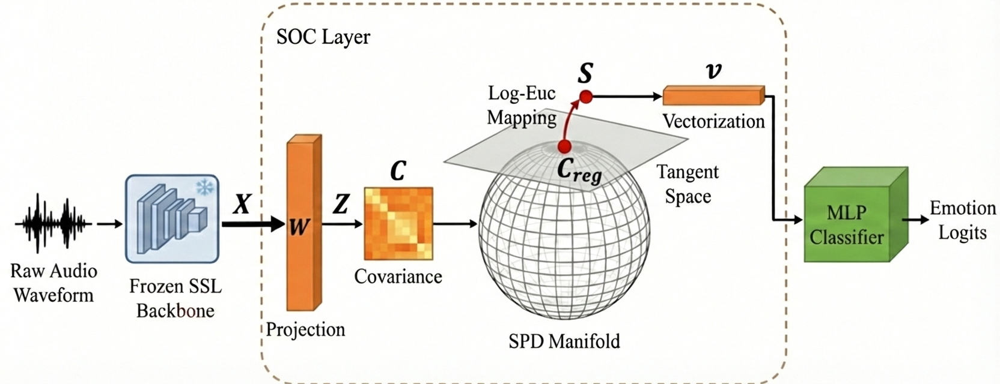

# SOC: Second-Order Correlation Pooling for SER

[](https://www.python.org/)
[](https://pytorch.org/)
[](LICENSE)
[]()
[]()

Minimal PyTorch implementation of **Geometric Second-Order Feature Correlation
Learning for Self-Supervised Speech Emotion Recognition**.

This work has been accepted by **Interspeech 2026**.

SOC aggregates frozen SSL frame-level speech representations by modelling
feature correlations as covariance descriptors, followed by Log-Euclidean
mapping and a lightweight classifier.

<p align="center">
  
</p>

This repository provides the SOC layer and training pipeline. It does not
include raw datasets, extracted features, model checkpoints, experiment logs, or
baseline implementations.

## Highlights

- Compact `SOCPooling` module for direct reuse in PyTorch projects.
- Training pipeline for EmoBox-style speaker-independent fold files.
- Feature extraction script for frozen Hugging Face SSL backbones.
- Tiny CPU smoke test that verifies the full training path.

## Quick Start

```bash
pip install -r requirements.txt
python scripts/smoke_test.py
```

Run all commands from the repository root.

## Use SOC in Your Model

```python
import torch
from soc_ser import SOCPooling

x = torch.randn(8, 120, 768)  # [batch, frames, ssl_dim]
pool = SOCPooling(in_dim=768, spd_dim=24)
z = pool(x)

print(z.shape)  # [8, 300]
```

## Data

Use EmoBox-style metadata and speaker-independent fold files. Place extracted
SSL features as `.npy` files whose names match the metadata `key` field.
Audio paths in the metadata should be valid from the repository root.

See `data/README.md` for the expected layout.

## Feature Extraction

```bash
python scripts/extract_features.py --config configs/ravdess_hubert.yaml
```

The feature extractor uses the `backbone_source`, `input_jsonl`, and
`feature_dir` fields in the config.

## Training

```bash
python scripts/train.py --config configs/ravdess_hubert.yaml
python scripts/train.py --config configs/esd_hubert.yaml
```

The default RAVDESS config uses five speaker-independent folds.

## Optional Visualization

After training a checkpoint, an optional t-SNE visualization utility is
available:

```bash
pip install -r requirements-viz.txt
python scripts/visualize_tsne.py \
  --config configs/ravdess_hubert.yaml \
  --fold 1 \
  --checkpoint outputs/ravdess_hubert_soc/fold_1_best.pth \
  --output figures/ravdess_fold1_tsne.png
```

See `docs/tsne_visualization.md` for details.

## Citation

If you use this repository, please cite our Interspeech 2026 paper:

```bibtex
@inproceedings{soc_interspeech2026,
  title     = {Geometric Second-Order Feature Correlation Learning for Self-Supervised Speech Emotion Recognition},
  author    = {Shuanglin Li,Ruxiao Qian,Siyang Song},
  booktitle = {Proc. Interspeech},
  year      = {2026}
}
```
